# Novo Sistema de Assinatura e Login - v2

## Informações do Sistema

- **Price ID (teste):** `price_1T9alEKdM6Yexsz15kuKCXnu`
- **Email assinante:** `wellington.engetec.am@gmail.com`
- **Data de nascimento:** coletada no perfil após login

## Arquitetura Nova

```mermaid
sequenceDiagram
    participant User as Usuário
    participant App as App.tsx
    participant Checkout as create-checkout
    participant Stripe as Stripe
    participant Webhook as stripe-webhook
    participant Callback as stripe-callback
    participant Supabase as Supabase Auth
    
    rect rgb(0, 80, 0)
        Note over User,Supabase: FLUXO 1: Checkout (Novo Assinante)
        User->>App: Email + Clica "Assinar"
        App->>Checkout: createCheckoutSession(email)
        Checkout->>Stripe: Cria Checkout Session
        Stripe-->>User: Redireciona para pagamento
        User->>Stripe: Completa pagamento
        Stripe-->>Webhook: Webhook: checkout.session.completed
        Webhook->>Supabase: createUser(email, name) c/ email_confirm: true
        Webhook->>Supabase: upsert subscription
        Webhook-->>App: Redirect: /?checkout=success&session_id=XXX
        App->>Callback: GET /stripe-callback?session_id=XXX
        Callback->>Stripe: Recupera session details
        Callback->>Callback: Gera JWT access_token + refresh_token
        Callback-->>User: Redirect: /?access_token=XX&refresh_token=YY
        User->>App: Acessa app com tokens na URL
        App->>App: setSession() → LOGADO!
    end
    
    rect rgb(80, 0, 0)
        Note over User,Supabase: FLUXO 2: Login (Assinante Existente)
        User->>App: Digita email
        App->>Supabase: invoke direct-login(email)
        Supabase->>Stripe: Verifica assinatura ativa
        Supabase->>Supabase: Gera JWT tokens
        Supabase-->>App: { access_token, refresh_token }
        App->>App: setSession() → LOGADO!
    end
```



## Mudanças Necessárias

### 1. Fix `stripe-webhook/index.ts` (HIGH PRIORITY)

**Problema atual:** Usa `inviteUserByEmail` que envia email desnecessário

**Solução:**
- Substituir `inviteUserByEmail` por `createUser` com `email_confirm: true`
- Não enviar email na criação do usuário

```typescript
// ANTES (envia email):
const { data: { user: newUser } } = await supabaseAdmin.auth.admin.inviteUserByEmail(email, {...});

// DEPOIS (cria direto):
const { data: { user: newUser } } = await supabaseAdmin.auth.admin.createUser({
  email: customerEmail,
  email_confirm: true,
  user_metadata: { full_name: customerName || 'Assinante Premium' }
});
```

### 2. Criar novo `stripe-callback/index.ts` (HIGH PRIORITY)

**Objetivo:** Após checkout, gerar tokens JWT e redirecionar para app logado

**Fluxo:**
1. Recebe `session_id` da URL
2. Recupera session da Stripe para ter email/name
3. Verifica se usuário existe no Supabase
4. Gera JWT access_token e refresh_token (como fiz no direct-login fix)
5. Redireciona para app com tokens na URL: `/?access_token=XX&refresh_token=YY&email=ZZ`

```typescript
// Endpoints
// GET /stripe-callback?session_id=cs_xxx
// Response: Redirect para /?access_token=XX&refresh_token=YY&email=ZZ
```

### 3. Fix `create-checkout/index.ts`

**Objetivo:** Garantir que success_url aponta para callback

```typescript
// DEPOIS
const success_url = `${productionUrl}/stripe-callback?session_id={CHECKOUT_SESSION_ID}`;
```

### 4. Fix `App.tsx` para processar tokens (HIGH PRIORITY)

**Objetivo:** Processar tokens na URL após redirect do checkout

```typescript
useEffect(() => {
  // 1. Verifica se há tokens na URL (do checkout)
  const urlParams = new URLSearchParams(window.location.search);
  const accessToken = urlParams.get('access_token');
  const refreshToken = urlParams.get('refresh_token');
  
  if (accessToken && refreshToken) {
    // 2. Define sessão no Supabase client
    supabase.auth.setSession({ access_token: accessToken, refresh_token: refreshToken })
      .then(({ error }) => {
        if (!error) {
          // 3. Limpa URL
          window.history.replaceState({}, '', '/');
          // 4. Mostra mensagem de sucesso
          showSuccessMessage();
        }
      });
  }
  
  // 5. Verifica também ?checkout=success&session_id= (fallback)
  const sessionId = urlParams.get('session_id');
  if (sessionId) {
    // Chama stripe-callback para obter tokens
    window.location.href = `/stripe-callback?session_id=${sessionId}`;
  }
}, []);
```

### 5. Fix `direct-login/index.ts` (JÁ FIXADO)

O fix que aplicamos anteriormente já corrige a geração de JWT tokens.

### 6. Criar tela de "Perfil" para coletar birth date

Após primeiro login, redirecionar para tela de completar perfil:

```
/complete-profile
  - Nome completo (já tem)
  - Data de nascimento (falta)
  - Email (já tem, não editável)
```

## Plano de Implementação

### Fase 1: Fixes Críticos (IMEDIATO)

- [ ] **1.1** Modificar `stripe-webhook/index.ts` - usar createUser em vez de inviteUserByEmail
- [ ] **1.2** Modificar `create-checkout/index.ts` - success_url para stripe-callback
- [ ] **1.3** Criar novo `stripe-callback/index.ts` - gerar tokens e redirecionar
- [ ] **1.4** Modificar `App.tsx` - processar tokens da URL

### Fase 2: Testes

- [ ] **2.1** Testar checkout completo com `wellington.engetec.am@gmail.com`
- [ ] **2.2** Verificar se token é gerado e login funciona
- [ ] **2.3** Testar login de assinante existente

### Fase 3: Melhorias

- [ ] **3.1** Criar tela de completar perfil (birth date)
- [ ] **3.2** Adicionar campo birth_date na tabela users (metadata)
- [ ] **3.3** Mostrar perfil com informações do cliente

## Arquivos a Modificar

| Arquivo | Mudança | Prioridade |
|---------|---------|------------|
| `stripe-webhook/index.ts` | createUser em vez de inviteUserByEmail | CRÍTICA |
| `stripe-callback/index.ts` | Novo fluxo com JWT | CRÍTICA |
| `create-checkout/index.ts` | success_url para callback | CRÍTICA |
| `App.tsx` | Processar tokens da URL | CRÍTICA |
| `direct-login/index.ts` | Já foi corrigido | OK |
| `profiles table` | Criar/adicionar birth_date | MELHORIA |

## Resumo do Fluxo Novo

```
1. Usuário entra email e clica "Assinar"
2. Redireciona para Stripe Checkout
3. Usuário paga
4. Stripe redireciona para /stripe-callback?session_id=XXX
5. stripe-callback:
   - Recupera dados do checkout
   - Gera JWT tokens
   - Redireciona para /?access_token=XX&refresh_token=YY
6. App.tsx processa tokens
7. Usuário está LOGADO!
8. Redireciona para completar perfil (birth date)
```

---

**Próximo passo:** Implementar as mudanças da Fase 1